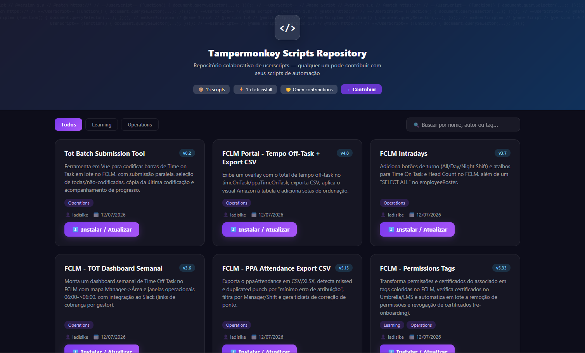

<div align="center">

# Amazon Tampermonkeys · FC GRU5

### Coleção de *userscripts* de automação e produtividade para o dia a dia do FC GRU5

Ferramentas para **Learning**, **Operations** e **WHS** — instaláveis com **1 clique** via [Tampermonkey](https://www.tampermonkey.net/).

<br/>


</div>

---

## 🚀 TamperHub

O **TamperHub** é o catálogo visual (QuickApp) para navegar, buscar e instalar todos os scripts deste repositório em 1 clique — com busca por nome, autor ou tag e filtros por time. O Tamperhub, só é possivel ser acessado caso tenha a permissão de uso na Amazon, basta requisitar ao seu gestor.

<div align="center">



<br/>

</div>

---

## 📦 Como instalar

1. Instale a extensão **[Tampermonkey](https://www.tampermonkey.net/)** no seu navegador (Chrome, Edge, Firefox, Opera ou Safari).
2. Clique no botão **⬇️ Instalar** do script desejado (na tabela abaixo ou no TamperHub).
3. O Tampermonkey intercepta o arquivo `.user.js` e abre a tela de instalação — confirme em **Instalar**.
4. Pronto! Abra a página do sistema alvo e o script já está ativo. Para **atualizar**, basta clicar de novo no mesmo link.

> 💡 Os scripts guardam configurações e estado localmente (armazenamento do Tampermonkey), por navegador/perfil.

---

## 🔧 Como extrair o link de instalação direta (para o TamperHub)

O **link de instalação direta** é simplesmente a URL **raw** do arquivo `.user.js` no GitHub. Quando o Tampermonkey está instalado, abrir essa URL dispara a tela de instalação automaticamente.

**Padrão do link:**

```
https://raw.githubusercontent.com/KevynFirst/amazon-tampermonkeys/main/<NOME-DO-ARQUIVO>.user.js
```

**Regras de codificação (URL-encoding)** — troque os caracteres especiais do nome do arquivo:

| Caractere | Vira | Exemplo |
|-----------|------|---------|
| espaço | `%20` | `Tot Batch` → `Tot%20Batch` |
| `+` | `%2B` | `Off-Task + Export` → `Off-Task%20%2B%20Export` |
| `→` (seta) | `%E2%86%92` | `GRU5 → Slack` → `GRU5%20%E2%86%92%20Slack` |
| `ô` (acento) | `%C3%B4` | `Cronômetro` → `Cron%C3%B4metro` |

**Como pegar rápido no próprio GitHub:** abra o arquivo `.user.js` no repositório → botão **Raw** → copie a URL da barra de endereços (já vem codificada). Cole essa URL no campo *Instalar / Atualizar* do card no TamperHub.

---

<div align="center">

Feito por Ladislau, Kevyn (@ladislke) 👾

</div>
